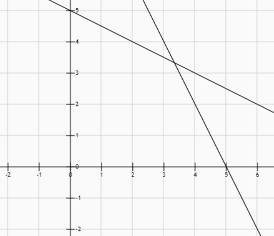
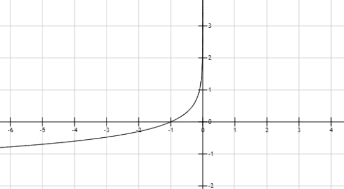
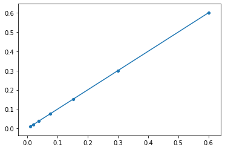

# interior_point_lp
Interior Point Method for Linear Programming Problem
----
**For better read experience, download or clone this project, and read this file locally**

## running requirements

* GCC version supports at leat C++ standard 11

* C++ Eigen Library, version 3.3.7,(already included in this project)

## explaination

In this project, the sample target function is

$$\min\ \  x+y\\
s.t.\ \ x+2y \leq 10\\
\ \ \ \ 2x+y\leq 10\\
\ \ \ \  x \geq 0\\
\ \ \ \ y \geq 0$$

The image of this problem is as follows.

It is easy to find the answer for the problem with this image. But for algorithm, it needs to search in the valid area.

In this project, interior point method is used with Newton direction. Firstly, we transform the format of this problem into a general one.

Let $c=\left(\begin{matrix}
    1\\
    1
\end{matrix}\right), A=\left(\begin{matrix}
    1 & 2\\
    2 & 1\\
    -1 & 0\\
    0 & -1
\end{matrix}\right),b=\left(\begin{matrix}
    1\\
    1\\
    0\\
    0
\end{matrix}\right),X=\left(\begin{matrix}
    x\\
    y
\end{matrix}\right)$.

Then, the problem can be written as

$$
\min\ \  c^T X\\
s.t.\ \ AX \leq b
$$

Applying Lagrange, we can get $f(x)=c^TX+\sum\limits_{i=1}^{m}I(A_jX_j-b)$, where $m$ is the first dimension size of $A$. We can learn from the target that, when $AX > b$ is not valid. So, 

$$I(x)=\left\{\begin{matrix}
    x, & x \leq 0\\
    +\infty,& x > 0
\end{matrix}\right.$$
then the minumum result achieved must be valid. However, this function indifferentiable points, a common method is using $\log$ function to approximate it. In this project, we use $-\frac{1}{t}log(-x)$, where $t$ is a tunable parameter, the larger the $t$, the more the func tie to the x coordinate and y coordinate at the same time more punish value for not valid x and nearly 0 for all valid x. And in this project, we will increase $t$ dynamically.

We can then rewrite the target function as:

$$
f(x)=tc^TX-\sum\limits_{i=1}^{m}\log(-A_{ij}X_j+b_i)
$$

Then, in order to get the direction in iterations, $X^{(n+1)}=X^{(n)}-Hessian^{-1}\nabla f$, we need to calculate the first order derivative and second order detivate.

For each $x$ in $X$, $\nabla f_{x_k}=tc_k-\sum\limits_{i=1}^{m}\frac{A_{ik}}{A_{ij}X_j-b_i}$, we can vectorize it, $\nabla f=tc-A^{T} \frac{1}{AX-b}$, and $\nabla^2 f=A^T D A$,where $D$ is diagonal matrix with values $\frac{1}{(Ax-b)^2}$.

Now, all the needed variables are calculated, when using this algorithm, we need to find a start point. In this project we choose $(3,3)$, and $t=0.1$. By running this algorithm, the return value *best_point* will be closer to $0,0$ during iteration. However, the result will stuck at aboud$(0.58,0.58)$. In this case, we reset start point as current point and reset $t=0.1$, and then continue. The algorithm will stop at a satisfying result.

Each point in the above graph is a change of the start point in the algorithm. We can see that the algorithm converges to $(0,0)$ steady.
